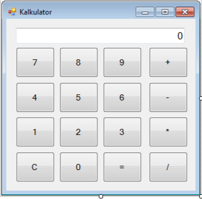

Projekt 2: enostavni kalkulator.

Potrebno je narediti enostavni kalkulator, ki bo zmožen izračunati osnovne matematične operacije: seštevanje, odštevanje, množenje in deljenje nad dvema celima številoma. Program se naredi, kot Windows aplikacija.

Na formi se dodajo gumbi za števila (0-9), osnovne operacije (+, -, *, /), brisanje rezultata (C), izračun (=) in prikaz rezultata. Forma naj bo izgledala takole:

Na samem začetku naj bo vrednost rezultata 0. Potem naj ima uporabnik možnost vtipkati prvo število. Lahko vtipka število dokler ne klikne na eno od neštevilčnih tipk. Če klikne na eno od operacij, se prvo število shrani in počaka na vnos drugega števila. Po vnosu drugega števila, ki se prekine s tipko za izračun '=', se izvede izračun. Če je tipka '=' izbrana takoj po vnosu prvega števila se isto število ponovi oz. ostane na zaslonu.

Klik na tipko 'C' vedno počisti rezultat.

Napotki za izvedbo:

· definirati potrebne spremenljivke (za shranjevanje števil, ...).

· v Designer-ju narisati formo: dodati gumbe in polje za prikaz rezultata; nastaviti ustrezne lastnosti.

· dodati metodo, ki se izvede na vsakem kliku na gumb s številom.

· dodati metodo, ki se izvede na vsakem kliku na gumb z operatorjem.

· dodati metodo, ki se izvede na gumbu za čiščenje (C).

· dodati metodo za izračun.

· dodati metodo za prikaz izračuna.

DOMAČA NALOGA:

---

Naloga: razširi funkcionalnost kalkulatorja tako, da dodaš gumbe za naslednje operacije:

· n! – po kliku naj se izračuna n!, kjer je n število, ki je trenutno vidno v oknu.

· xy – naj izračuna y-to potenco števila x.

Obe metodi, ki izvajata izračuna naj bosta rekurzivni!
